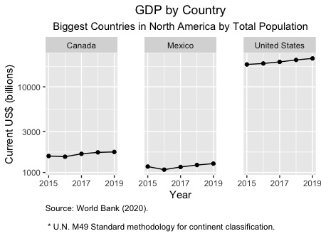
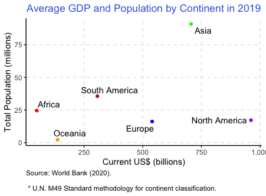
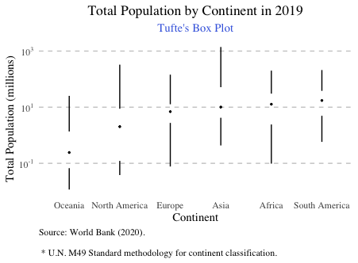
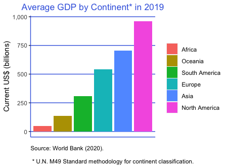

```{r setup, include=FALSE}

######DO NOT MODIFY. This will load required packages.

knitr::opts_chunk$set(echo = TRUE)
library(tidyverse)
```

Following the directions on the Coursera assignment page, you will make four original visualizations. Note that the data for the CCES and CEL data are imported in code in the R Markdown file.

### Put your name here: LUIS MORENO

## Exercise 1

**Explain what you are visualizing here**: A line plot that shows the evolution of GDP (in U.S. dollars) from 2015 to 2019 for the biggest countries in North America based on total population.

**Put your figure here**: 

```{r exercise1,echo=FALSE}

####PUT YOUR CODE HERE
  

```

## Exercise 2

**Explain what you are visualizing here**: A scatter plot that shows the relationship between average GDP and and average Total Population by continent in 2019.

**Put your figure here**:

```{r exercise2,echo=FALSE}

####PUT YOUR CODE HERE
  
```

## Exercise 3

**Explain what you are visualizing here**: A box plot that shows the distribution of the Total Population by continent in 2019 with Tufte's Box Plot theme.

**Put your figure here**: 

```{r exercise3,echo=FALSE}

####PUT YOUR CODE HERE

```

## Exercise 4

**Explain what you are visualizing here**: A bar plot that shows the average GDP by Continent in 2019.

**Put your figure here**: 

```{r exercise4,echo=FALSE}

####PUT YOUR CODE HERE

```
